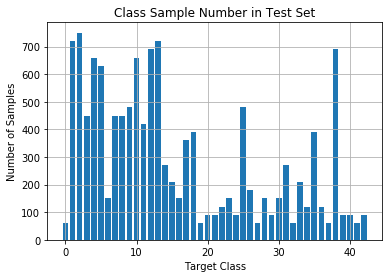
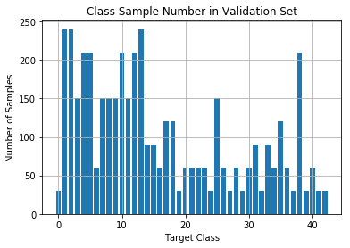
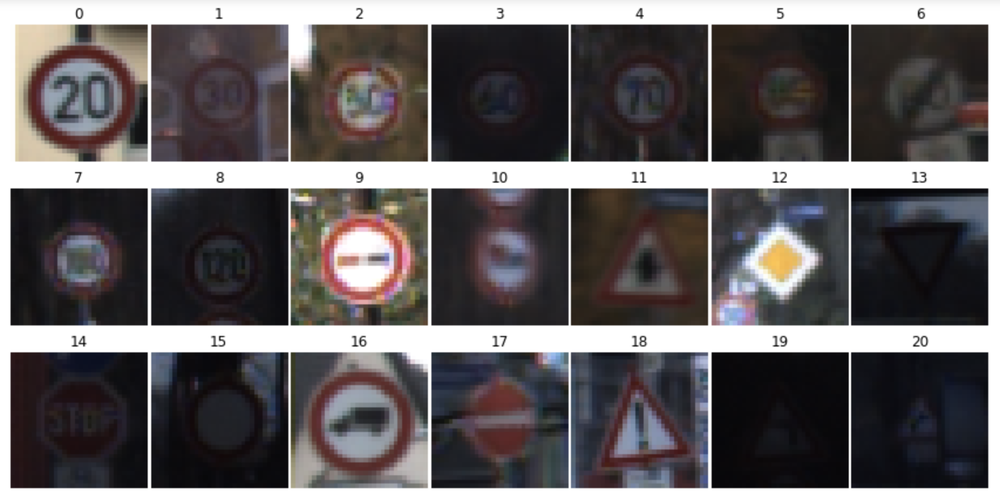
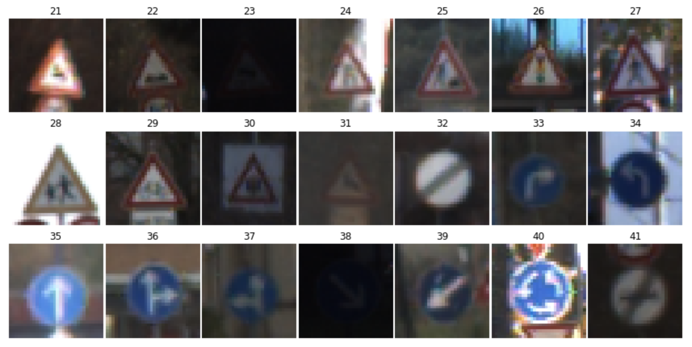
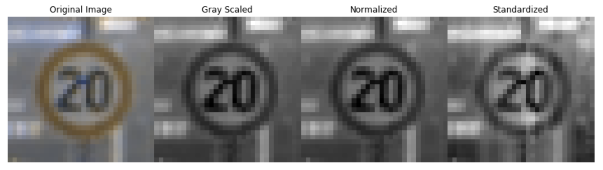

# **German Traffic Sign Classification Deep Neural Networks** 

---

**Build a Traffic Sign Recognition Project**

The goals / steps of this project are the following:
* Load the data set (see below for links to the project data set)
* Explore, summarize and visualize the data set
* Design, train and test a model architecture
* Use the model to make predictions on new images
* Analyze the softmax probabilities of the new images

[//]: # (Image References)

[image1]: ./examples/visualization.jpg "Visualization"
[image2]: ./examples/grayscale.jpg "Grayscaling"
[image3]: ./examples/random_noise.jpg "Random Noise"
[image4]: ./examples/placeholder.png "Traffic Sign 1"
[image5]: ./examples/placeholder.png "Traffic Sign 2"
[image6]: ./examples/placeholder.png "Traffic Sign 3"
[image7]: ./examples/placeholder.png "Traffic Sign 4"
[image8]: ./examples/placeholder.png "Traffic Sign 5"

---
### Introduction

#### 1. This project utilizes Deep Neural Networks and Convolutional Neural Networks which is derived from traditional LeNet and Multiscale Convolutional Neural Network. The dataset can be retrived from [German Traffic Sign official website](http://benchmark.ini.rub.de/?section=gtsrb&subsection=dataset)

### Data Set Summary & Exploration

#### 1. Data set summary.

The data set summary are retrived from numpy and visualized with matplotlib library.

* The size of training set is 34799
* The size of the validation set is 4410
* The size of test set is 12630
* The shape of a traffic sign image is 32x32x3
* The number of unique classes/labels in the data set is 43

                       

#### 2. Exploratory visualization of the dataset.

The images below includes a preview of the dataset from class 0 - 41. Their corresponding sign name can be found in [mapping](https://github.com/apobec3f/German-Traffic-Sign-Classifier/tree/master/mapping)

              

### Design and Test Model Architecture

#### 1. Image preprocessing and data augmentation
Three preprocess techniques are used to preprocess image data: gray scaling, normalize pixel value so that every pixel preserves values from [-1, 1] and Lastly standardizing. 

Gary scaling the images is a crutial part to simplify training process but eliminating the 3 channels complication at input phase. This tecnique is effective because after previewing the data set, all classes have distinct shapes which means they don't need to be uniquely identified by color. Thus gray scaling the training data set will not sacrifies training accuracy.

Normalization is used so that the input pixel values have similar size, preventing bigger (closer to 255) values being treated with high priority compared to lighter color pixels (closer to 0) thus introducing biases during training.

standadizing techniques are used to normalized input pixel values of every image to have 0 mean because weight decay and Bayesian estimation (not used here but broadly used in machine learning field) can be done more conveniently with standardized inputs.

The above three steps are performed on a testing image as shown below:

However, another issue of the dataset is big variance between the number of training images among all classes as we see before. To prevent such difference introducing biases during training, data augmentation techniques are used to generate "fake" data from existing training data. To do this, four techniques are used: flip left and right, flip up and down, rotate 90 degrees and zoom in by a factor of 1.5. At first, the mean number of data set if calculated (eg. training set has a mean number of data of 900 images/class). Then all classes with less images are augmented until they have at least 900 images utilizing the above 4 techniques. The final training, valid and test data are as follows.

Notice that the valid and test set is the same as before. Augmenting the valid and test dataset will change the evaluation metrics, and results in different testing conditions and accuracy evaluation compared to other researchers using the same validation and test set

                     
      
#### 2. Model Architecture

My final model consisted of the following layers:

| Layer         		|     Description	        					| 
|:---------------------:|:---------------------------------------------:| 
| Input         		| 32x32x3 RGB image   							| 
| Convolution 3x3     	| 1x1 stride, same padding, outputs 32x32x64 	|
| RELU					|												|
| Max pooling	      	| 2x2 stride,  outputs 16x16x64 				|
| Convolution 3x3	    | etc.      									|
| Fully connected		| etc.        									|
| Softmax				| etc.        									|
|						|												|
|						|												|
 

#### 3. Describe how you trained your model. The discussion can include the type of optimizer, the batch size, number of epochs and any hyperparameters such as learning rate.

To train the model, I used an ....

#### 4. Describe the approach taken for finding a solution and getting the validation set accuracy to be at least 0.93. Include in the discussion the results on the training, validation and test sets and where in the code these were calculated. Your approach may have been an iterative process, in which case, outline the steps you took to get to the final solution and why you chose those steps. Perhaps your solution involved an already well known implementation or architecture. In this case, discuss why you think the architecture is suitable for the current problem.

My final model results were:
* training set accuracy of ?
* validation set accuracy of ? 
* test set accuracy of ?

If an iterative approach was chosen:
* What was the first architecture that was tried and why was it chosen?
* What were some problems with the initial architecture?
* How was the architecture adjusted and why was it adjusted? Typical adjustments could include choosing a different model architecture, adding or taking away layers (pooling, dropout, convolution, etc), using an activation function or changing the activation function. One common justification for adjusting an architecture would be due to overfitting or underfitting. A high accuracy on the training set but low accuracy on the validation set indicates over fitting; a low accuracy on both sets indicates under fitting.
* Which parameters were tuned? How were they adjusted and why?
* What are some of the important design choices and why were they chosen? For example, why might a convolution layer work well with this problem? How might a dropout layer help with creating a successful model?

If a well known architecture was chosen:
* What architecture was chosen?
* Why did you believe it would be relevant to the traffic sign application?
* How does the final model's accuracy on the training, validation and test set provide evidence that the model is working well?
 

### Test a Model on New Images

#### 1. Choose five German traffic signs found on the web and provide them in the report. For each image, discuss what quality or qualities might be difficult to classify.

Here are five German traffic signs that I found on the web:

![alt text][image4] ![alt text][image5] ![alt text][image6] 
![alt text][image7] ![alt text][image8]

The first image might be difficult to classify because ...

#### 2. Discuss the model's predictions on these new traffic signs and compare the results to predicting on the test set. At a minimum, discuss what the predictions were, the accuracy on these new predictions, and compare the accuracy to the accuracy on the test set (OPTIONAL: Discuss the results in more detail as described in the "Stand Out Suggestions" part of the rubric).

Here are the results of the prediction:

| Image			        |     Prediction	        					| 
|:---------------------:|:---------------------------------------------:| 
| Stop Sign      		| Stop sign   									| 
| U-turn     			| U-turn 										|
| Yield					| Yield											|
| 100 km/h	      		| Bumpy Road					 				|
| Slippery Road			| Slippery Road      							|

The model was able to correctly guess 4 of the 5 traffic signs, which gives an accuracy of 80%. This compares favorably to the accuracy on the test set of ...

#### 3. Describe how certain the model is when predicting on each of the five new images by looking at the softmax probabilities for each prediction. Provide the top 5 softmax probabilities for each image along with the sign type of each probability. (OPTIONAL: as described in the "Stand Out Suggestions" part of the rubric, visualizations can also be provided such as bar charts)

The code for making predictions on my final model is located in the 11th cell of the Ipython notebook.

For the first image, the model is relatively sure that this is a stop sign (probability of 0.6), and the image does contain a stop sign. The top five soft max probabilities were

| Probability         	|     Prediction	        					| 
|:---------------------:|:---------------------------------------------:| 
| .60         			| Stop sign   									| 
| .20     				| U-turn 										|
| .05					| Yield											|
| .04	      			| Bumpy Road					 				|
| .01				    | Slippery Road      							|

For the second image ... 

### (Optional) Visualizing the Neural Network (See Step 4 of the Ipython notebook for more details)
#### 1. Discuss the visual output of your trained network's feature maps. What characteristics did the neural network use to make classifications?

